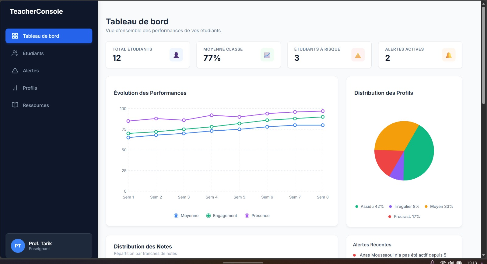
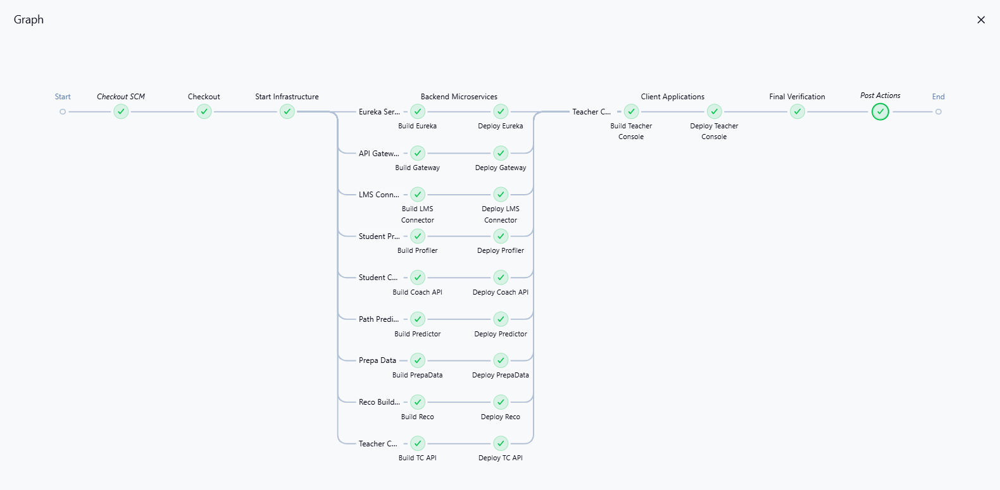

# 🎓📈 EduPath-MS — Intelligent Learning Analytics & Recommendation System

<div align="center">
  <picture>
    
  </picture>
</div>

**EduPath-MS** is a cutting-edge, microservices-based platform designed to enhance student success in higher education. By leveraging advanced data analytics and machine learning, it processes learning traces from LMS platforms (like Moodle) to predict dropout risks, categorize student behaviors, and provide personalized pedagogical recommendations.

---

## Contents

- [Overview](#overview)
- [Features](#features)
- [Monorepo Layout](#monorepo-layout)
- [Architecture](#architecture)
- [Microservices Portfolio](#microservices-portfolio)
- [Quick Start (Docker)](#quick-start-docker)
- [Access Points](#access-points)
- [Testing & QA](#testing--qa)
- [Security](#security)
- [Demo Videos](#demo-videos)
- [Contributing](#contributing)
- [License](#license)

---

## Overview

- **Goal:** Enhance student success by predicting dropout risks and providing personalized pedagogical recommendations.
- **How:** Ingest learning traces from Moodle LMS → ETL processing via Airflow → ML Engines (Clustering, XGBoost, BERT) → Delivery via API Gateway to Web/Mobile clients.
- **Why hybrid:** Combines advanced data processing with machine learning for deep insights into student behaviors and outcomes.

---

## Features

- 📊 **Real-time Analytics:** Process raw data (grades, logs) from Moodle LMS.
- 🤖 **Intelligence Engines:**
    - **Student Profiler:** Segments students using K-Means clustering.
    - **Path Predictor:** Forecasts success/dropout probabilities using XGBoost.
    - **Reco Builder:** Generates content recommendations using BERT embeddings & Faiss.
- 🔔 **Asynchronous Alerting:** Critical events trigger alerts via RabbitMQ.
- 📱 **Multi-platform Delivery:** Responsive Web Dashboard (Teacher Console) and Mobile App (Student Coach).
- ⚙️ **DevOps Ready:** Fully containerized with Docker and automated CI/CD via Jenkins.

---

## Monorepo Layout

```
EduPath-MS/
├─ microservices/
│  ├─ api-gateway/            # Unified entry point (Node.js)
│  ├─ eureka-server/          # Service Discovery (Spring Boot)
│  ├─ lms-connector/          # Moodle API connector (Node.js)
│  ├─ prepa-data/             # ETL Pipelines (Airflow/Python)
│  ├─ path-predictor/         # ML Dropout Prediction (Python)
│  ├─ student-profiler/       # ML Student Clustering (Python)
│  ├─ reco-builder/           # ML Recommendations (Python)
│  ├─ teacher-console-api/    # Teacher BFF (Python)
│  ├─ student-coach-api/      # Student BFF (Python)
│  ├─ TeacherConsole/         # Web Dashboard (Angular)
│  └─ student_coach/          # Mobile Application (Flutter)
├─ screens/                   # UI Screenshots
├─ sql/                       # Database initialization scripts
└─ docker-compose.yml
```

---

## Architecture


*Automated build, test, and deployment of microservices and client applications.*

The project is built on a **secure, event-driven microservices architecture**, fully containerized using **Docker** and orchestrated via **Docker Compose**.

### High-Level Data Flow
1.  **Ingestion**: `LMS Connector` polls raw data (grades, logs) from the Moodle LMS.
2.  **Processing (ETL)**: `PrepaData`, orchestrated by **Apache Airflow**, cleanses and transforms data into standardized performance metrics.
3.  **Intelligence Engines**:
    *   **Student Profiler**: Segments students using K-Means clustering.
    *   **Path Predictor**: Forecasts success/dropout probabilities using XGBoost.
    *   **Reco Builder**: Generates content recommendations using BERT embeddings & Faiss.
4.  **Alerting**: Critical events trigger asynchronous alerts via **RabbitMQ**.
5.  **Delivery**: A centralized **API Gateway** routes data to the **Teacher Console** (Web) and **Student Coach** (Mobile).

---

## Microservices Portfolio

| Service Name | Stack | Port | Description |
| :--- | :--- | :--- | :--- |
| **API Gateway** | Node.js / Express (REST) | `4000` | Unified entry point, JWT auth, Socket.io, and routing. |
| **Eureka Server** | Java / Spring Boot | `8761` | Service Registry & Discovery. |
| **LMS Connector** | Node.js / Express | `3001` | Connects to Moodle API to fetch raw data. |
| **PrepaData** | Python / FastAPI / Airflow | `N/A` | ETL pipelines managed by Airflow (UI: `8081`). |
| **Student Profiler** | Python / FastAPI | `8000` | ML Service for student behavioral clustering. |
| **Path Predictor** | Python / FastAPI | `8002` | ML Service for dropout risk prediction (XGBoost). |
| **Reco Builder** | Python / FastAPI | `8003` | ML Service for personalized content recommendations. |
| **Teacher Console API**| Python / FastAPI | `8004` | BFF (Backend for Frontend) for the Teacher Dashboard. |
| **Student Coach API** | Python / FastAPI | `8005` | BFF for the Student Mobile App (LMS stats & Alerts). |
| **Teacher Console** | Angular | `8088` | Responsive Web Dashboard for instructors. |
| **Student Coach** | Flutter | N/A | Cross-platform mobile application for students. |

### Infrastructure & Tools

| Service | Type | Port / UI | Description |
| :--- | :--- | :--- | :--- |
| **PostgreSQL** | Database | `5432` | Primary transactional database (per-service schemas). |
| **RabbitMQ** | Message Broker | `5672` (AMQP) <br> `15672` (UI) | Asynchronous messaging for alerts and events. |
| **MinIO** | Object Storage | `9999` (API) <br> `9998` (UI) | S3-compatible storage for artifacts and datasets. |
| **Elasticsearch** | Search Engine | `9200` | Log aggregation and full-text search. |
| **MLflow** | MLOps | `5000` (UI) | Model registry and experiment tracking. |
| **phpMyAdmin** | Database UI | `8082` (UI) | Web interface for managing Moodle MySQL database. |
| **Moodle** | LMS | `80` | Learning Management System instance. |

---

## Quick Start (Docker)

1.  **Clone the Repository**
    ```bash
    git clone https://github.com/NisrineLachguer/EduPath-MS.git
    cd EduPath-MS
    ```

2.  **Start the Platform**
    Use Docker Compose to build and start all services.
    ```bash
    docker-compose up -d --build
    ```
    > *Note: First-time build may take 10-15 minutes as ML models (BERT) and base images are downloaded.*

3.  **Verify Status**
    Check if all containers are healthy:
    ```bash
    docker-compose ps
    ```

---

## Access Points

*   **Service Registry (Eureka)**: [http://localhost:8761](http://localhost:8761)
*   **API Gateway**: [http://localhost:4000](http://localhost:4000)
*   **Teacher Console**: [http://localhost:8088](http://localhost:8088)
*   **Airflow UI**: [http://localhost:8081](http://localhost:8081)
*   **RabbitMQ Management**: [http://localhost:15672](http://localhost:15672) (User/Pass: `edupath`/`edupath`)
*   **MinIO Console**: [http://localhost:9998](http://localhost:9998)
*   **MLflow UI**: [http://localhost:5000](http://localhost:5000)
*   **phpMyAdmin**: [http://localhost:8082](http://localhost:8082)
*   **Moodle LMS**: [http://localhost:80](http://localhost:80)

---

## Testing & QA

### Full Integration Test (Moodle -> Analytics)
1.  **Login to Moodle** (`localhost:80`) as Admin.
2.  Create a course and enroll test users.
3.  Simulate student activity (grades, logs).
4.  Trigger the **Airflow DAG** manually via `localhost:8081`.
5.  Observe data flowing to **Postgres**.
6.  Check **Teacher Console** (`localhost:8088`) to see updated risks and profiles.

---

## Security

*   **Authentication**: Key services are protected behind the API Gateway.
*   **JWT**: Stateless authentication using JSON Web Tokens.
*   **Isolation**: Each microservice manages its own database schema.

---

## Demo Videos

<div align="center">

[▶ Video Demonstration 1](https://github.com/user-attachments/assets/88387013-8b25-4da8-a9e7-193cb7223aa2)  
[▶ Video Demonstration 2](https://github.com/user-attachments/assets/736e9f77-85bc-4fa9-a653-56e57d0ce507)

</div>

---

## Contributing

We welcome contributions!

**Contributors**
- **Oumayma Ouedrhiri** — [ResearchGate](https://www.researchgate.net/profile/Oumayma-Ouedrhiri)
- **Hiba Tabbaa** — [ResearchGate](https://www.researchgate.net/profile/Hiba-Tabbaa)
- **Mohamed Lachgar** — [ResearchGate](https://www.researchgate.net/profile/Mohamed-Lachgar)
- **Khaoula2001** — [GitHub](https://github.com/Khaoula2001)
- **NisrineLachguer** — [GitHub](https://github.com/NisrineLachguer)
- **omarox844** — [GitHub](https://github.com/omarox844)

*Made with ❤️ by EduPath Team.*

---

## License

Ce projet est sous licence MIT - voir le fichier [LICENSE](LICENSE) pour plus de détails.
